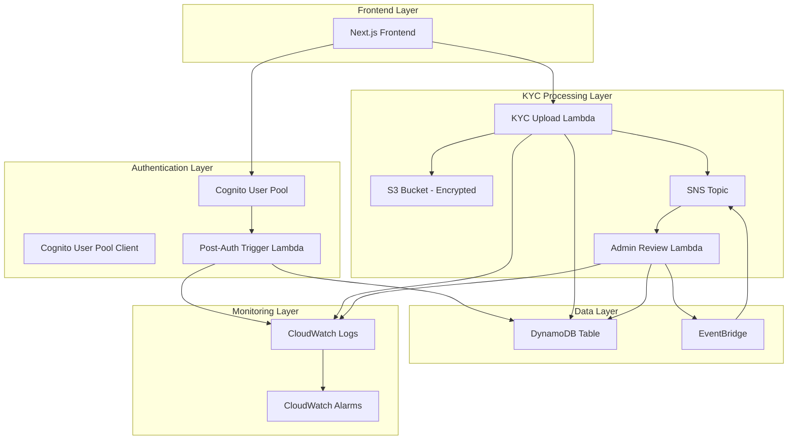
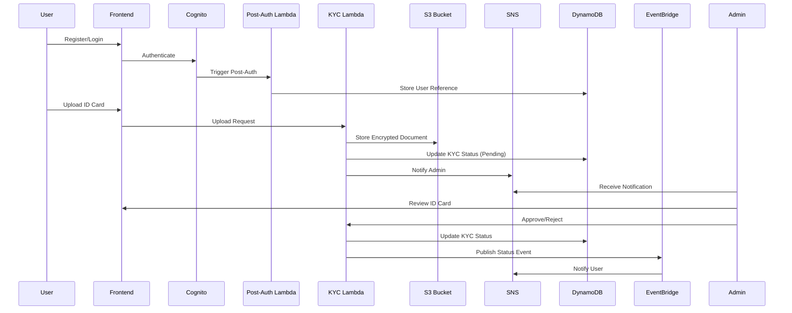

# Design Document

## Overview

The Cognito Authentication and KYC system is designed as a serverless, event-driven architecture that provides secure user authentication and regulatory compliance for the Sachain platform. The system leverages AWS Cognito for identity management, S3 for secure document storage, DynamoDB for user data persistence, and EventBridge for decoupled event processing.

The architecture follows AWS Well-Architected Framework principles, emphasizing security, reliability, performance efficiency, cost optimization, and operational excellence. All components are implemented using AWS CDK with TypeScript to ensure infrastructure as code best practices.

## Architecture

### High-Level Architecture



### Event Flow Architecture



## Components and Interfaces

### 1. AWS Cognito User Pool

**Purpose**: Centralized user identity and authentication management

**Configuration**:

- Password policies with complexity requirements
- MFA support (optional, configurable)
- Email verification required
- Custom attributes for user metadata
- Lambda triggers for post-authentication processing

**Security Features**:

- Advanced security features enabled
- Account takeover protection
- Compromised credentials detection
- Rate limiting on authentication attempts

### 2. Post-Authentication Lambda Function

**Purpose**: Process user data after successful authentication and store references in DynamoDB

**Interface**:

```typescript
interface PostAuthEvent {
  version: string;
  region: string;
  userPoolId: string;
  userName: string;
  callerContext: {
    awsSdkVersion: string;
    clientId: string;
  };
  triggerSource: string;
  request: {
    userAttributes: Record<string, string>;
    clientMetadata?: Record<string, string>;
  };
  response: {};
}

interface UserReference {
  PK: string; // USER#${userId}
  SK: string; // PROFILE
  userId: string;
  email: string;
  createdAt: string;
  updatedAt: string;
  kycStatus: "not_started" | "pending" | "approved" | "rejected";
  userType: "entrepreneur" | "investor";
}
```

**Functionality**:

- Extract user attributes from Cognito event
- Create user reference record in DynamoDB
- Initialize KYC status as 'not_started'
- Implement retry logic with exponential backoff
- Comprehensive error logging

### 3. KYC Upload Lambda Function

**Purpose**: Handle National ID card uploads and initiate admin review process

**Interface**:

```typescript
interface KYCUploadRequest {
  userId: string;
  documentType: "national_id";
  fileData: string; // Base64 encoded
  fileName: string;
  fileSize: number;
  mimeType: string;
}

interface KYCUploadResponse {
  success: boolean;
  documentId: string;
  uploadUrl?: string;
  error?: string;
}

interface KYCDocument {
  PK: string; // USER#${userId}
  SK: string; // KYC#${documentId}
  documentId: string;
  userId: string;
  documentType: string;
  s3Key: string;
  s3Bucket: string;
  status: "pending" | "approved" | "rejected";
  uploadedAt: string;
  reviewedAt?: string;
  reviewedBy?: string;
  reviewComments?: string;
}
```

**Functionality**:

- Validate file type and size (max 10MB, PNG/JPG/PDF)
- Generate unique document ID and S3 key
- Upload to encrypted S3 bucket
- Update DynamoDB with document metadata
- Send SNS notification to admin
- Implement retry logic for S3 and DynamoDB operations

### 4. Admin Review Lambda Function

**Purpose**: Process admin approval/rejection decisions for KYC documents

**Interface**:

```typescript
interface AdminReviewRequest {
  documentId: string;
  action: "approve" | "reject";
  comments?: string;
  reviewedBy: string;
}

interface KYCStatusChangeEvent {
  eventType: "kyc_status_changed";
  userId: string;
  documentId: string;
  oldStatus: string;
  newStatus: string;
  reviewedBy: string;
  reviewedAt: string;
  comments?: string;
}
```

**Functionality**:

- Validate admin permissions
- Update document status in DynamoDB
- Update user KYC status
- Publish status change event to EventBridge
- Send user notification via SNS
- Create audit log entries

### 5. S3 Bucket for Document Storage

**Configuration**:

- Server-side encryption with AWS KMS
- Versioning enabled
- Lifecycle policies for cost optimization
- Access logging enabled
- Public access blocked
- Cross-region replication for disaster recovery

**Security**:

- Bucket policy restricting access to Lambda execution roles
- KMS key with appropriate permissions
- VPC endpoint for private access (if needed)

### 6. DynamoDB Single Table Design

**Table Structure**:

```
Primary Key: PK (Partition Key), SK (Sort Key)

Access Patterns:
1. Get user profile: PK=USER#${userId}, SK=PROFILE
2. Get user KYC documents: PK=USER#${userId}, SK begins_with KYC#
3. Get specific KYC document: PK=USER#${userId}, SK=KYC#${documentId}
4. Query users by KYC status: GSI on kycStatus
5. Query documents by status: GSI on status
```

**Global Secondary Indexes**:

- GSI1: kycStatus (PK), createdAt (SK) - for admin dashboard
- GSI2: documentStatus (PK), uploadedAt (SK) - for document management

### 7. EventBridge Integration

**Event Patterns**:

```typescript
interface BaseEvent {
  source: "sachain.kyc";
  "detail-type": string;
  detail: any;
}

interface KYCStatusChangedEvent extends BaseEvent {
  "detail-type": "KYC Status Changed";
  detail: {
    userId: string;
    documentId: string;
    oldStatus: string;
    newStatus: string;
    reviewedBy: string;
    timestamp: string;
  };
}
```

**Event Rules**:

- Route KYC approval events to user notification service
- Route KYC rejection events to user notification service
- Route all KYC events to audit logging service

## Data Models

### User Profile Model

```typescript
interface UserProfile {
  PK: string; // USER#${userId}
  SK: string; // PROFILE
  userId: string;
  email: string;
  firstName?: string;
  lastName?: string;
  userType: "entrepreneur" | "investor";
  kycStatus: "not_started" | "pending" | "approved" | "rejected";
  createdAt: string;
  updatedAt: string;
  lastLoginAt?: string;
  emailVerified: boolean;
}
```

### KYC Document Model

```typescript
interface KYCDocument {
  PK: string; // USER#${userId}
  SK: string; // KYC#${documentId}
  documentId: string;
  userId: string;
  documentType: "national_id";
  s3Bucket: string;
  s3Key: string;
  originalFileName: string;
  fileSize: number;
  mimeType: string;
  status: "pending" | "approved" | "rejected";
  uploadedAt: string;
  reviewedAt?: string;
  reviewedBy?: string;
  reviewComments?: string;
  expiresAt?: string; // For document expiration
}
```

### Audit Log Model

```typescript
interface AuditLog {
  PK: string; // AUDIT#${date}
  SK: string; // ${timestamp}#${userId}#${action}
  userId: string;
  action: string;
  resource: string;
  timestamp: string;
  ipAddress?: string;
  userAgent?: string;
  result: "success" | "failure";
  errorMessage?: string;
}
```

## Error Handling

### Lambda Function Error Handling

**Retry Strategy**:

- Exponential backoff with jitter
- Maximum 3 retry attempts
- Dead letter queues for failed events
- Circuit breaker pattern for external dependencies

**Error Categories**:

1. **Transient Errors**: Network timeouts, service throttling

   - Automatic retry with exponential backoff
   - CloudWatch metrics and alarms

2. **Permanent Errors**: Invalid input, authorization failures

   - Immediate failure with detailed logging
   - User-friendly error messages

3. **System Errors**: Service unavailability, configuration issues
   - Circuit breaker activation
   - Fallback mechanisms where possible

### S3 Upload Error Handling

```typescript
const uploadWithRetry = async (params: S3.PutObjectRequest, maxRetries = 3) => {
  for (let attempt = 1; attempt <= maxRetries; attempt++) {
    try {
      return await s3.putObject(params).promise();
    } catch (error) {
      if (attempt === maxRetries || !isRetryableError(error)) {
        throw error;
      }
      await delay(Math.pow(2, attempt) * 1000 + Math.random() * 1000);
    }
  }
};
```

### DynamoDB Error Handling

```typescript
const writeWithRetry = async (params: DynamoDB.DocumentClient.PutItemInput) => {
  const backoff = new ExponentialBackoff({
    maxRetries: 3,
    baseDelay: 100,
    maxDelay: 5000,
  });

  return backoff.execute(async () => {
    return await dynamodb.put(params).promise();
  });
};
```

## Testing Strategy

### Unit Testing

**Lambda Functions**:

- Mock AWS SDK calls using aws-sdk-mock
- Test business logic in isolation
- Validate error handling scenarios
- Test retry mechanisms

**Test Structure**:

```typescript
describe("PostAuthenticationLambda", () => {
  beforeEach(() => {
    AWSMock.setSDKInstance(AWS);
  });

  afterEach(() => {
    AWSMock.restore();
  });

  it("should create user profile on successful authentication", async () => {
    // Mock DynamoDB put operation
    AWSMock.mock("DynamoDB.DocumentClient", "put", (params, callback) => {
      callback(null, {});
    });

    const event = createMockCognitoEvent();
    const result = await handler(event);

    expect(result).toBeDefined();
    // Additional assertions
  });
});
```

### Integration Testing

**API Testing**:

- Test complete authentication flow
- Validate KYC upload and approval process
- Test error scenarios and edge cases
- Performance testing under load

**Infrastructure Testing**:

- CDK unit tests for stack configuration
- Integration tests for deployed resources
- Security testing for IAM permissions
- End-to-end testing of event flows

### Load Testing

**Performance Targets**:

- Authentication: < 500ms response time
- KYC Upload: < 2s for 5MB files
- Admin Review: < 200ms response time
- DynamoDB: < 100ms read/write latency

**Testing Tools**:

- Artillery.js for load testing
- AWS X-Ray for distributed tracing
- CloudWatch Insights for log analysis

## Security Considerations

### Data Encryption

**At Rest**:

- S3: Server-side encryption with AWS KMS
- DynamoDB: Encryption at rest enabled
- Lambda: Environment variables encrypted with KMS

**In Transit**:

- HTTPS/TLS 1.2+ for all API communications
- VPC endpoints for internal AWS service communication
- Certificate pinning for mobile applications

### Access Control

**IAM Roles and Policies**:

- Least privilege principle
- Resource-based policies for fine-grained access
- Cross-account access controls
- Regular access reviews and rotation

**API Security**:

- Cognito JWT token validation
- Rate limiting and throttling
- Input validation and sanitization
- CORS configuration

### Compliance and Auditing

**Audit Logging**:

- All user actions logged with timestamps
- Admin actions tracked with user attribution
- Failed authentication attempts monitored
- Data access patterns analyzed

**Compliance Features**:

- GDPR data deletion capabilities
- Data retention policies
- Consent management
- Privacy controls

## Monitoring and Observability

### CloudWatch Metrics

**Custom Metrics**:

- Authentication success/failure rates
- KYC upload success rates
- Document review processing times
- User registration trends

**Alarms**:

- High error rates (> 5% in 5 minutes)
- Lambda function duration (> 10 seconds)
- DynamoDB throttling events
- S3 upload failures

### Logging Strategy

**Structured Logging**:

```typescript
const logger = {
  info: (message: string, context: any) => {
    console.log(
      JSON.stringify({
        level: "INFO",
        message,
        timestamp: new Date().toISOString(),
        requestId: context.awsRequestId,
        ...context,
      })
    );
  },
};
```

**Log Aggregation**:

- Centralized logging with CloudWatch Logs
- Log retention policies (30 days for debug, 1 year for audit)
- Log insights queries for troubleshooting
- Real-time log streaming for critical errors

### Distributed Tracing

**AWS X-Ray Integration**:

- End-to-end request tracing
- Performance bottleneck identification
- Error root cause analysis
- Service dependency mapping

## Cost Optimization

### Resource Optimization

**Lambda Functions**:

- Right-sized memory allocation based on profiling
- Provisioned concurrency for predictable workloads
- ARM-based Graviton2 processors where applicable

**DynamoDB**:

- On-demand billing for variable workloads
- Auto-scaling for predictable patterns
- Efficient query patterns to minimize RCU/WCU

**S3 Storage**:

- Intelligent tiering for cost optimization
- Lifecycle policies for archival
- Compression for large documents

### Monitoring and Alerts

**Cost Monitoring**:

- AWS Cost Explorer integration
- Budget alerts for unexpected spending
- Resource utilization dashboards
- Regular cost optimization reviews
