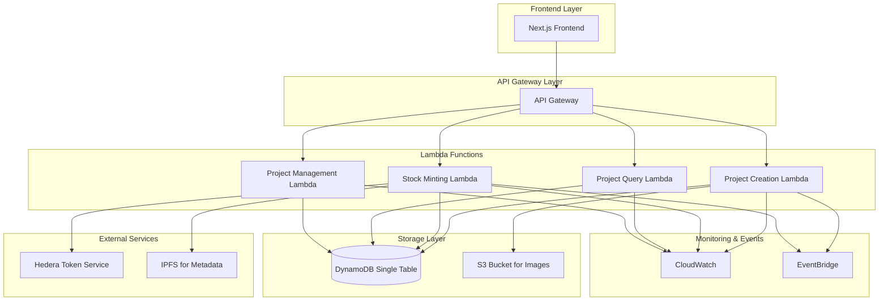

# Design Document

## Overview

The Entrepreneur Project Creation & Stock Issuance feature enables entrepreneurs to create projects on the Sachain platform and issue digital shares as NFTs using Hedera Token Service (HTS). This feature integrates with the existing KYC/authentication system and follows the established patterns for data storage, API design, and infrastructure.

The system will extend the current single-table DynamoDB design to accommodate project and stock data, implement new Lambda functions for project management and Hedera integration, and provide secure APIs for project creation and NFT minting operations.

## Architecture

### High-Level Architecture



### Data Flow

1. **Project Creation Flow**:

   - Entrepreneur submits project details via frontend
   - API Gateway routes to Project Creation Lambda
   - Lambda validates entrepreneur KYC status
   - Project data is stored in DynamoDB
   - Cover image is uploaded to S3
   - EventBridge event published for project creation

2. **Stock Minting Flow**:
   - Entrepreneur initiates stock minting
   - Stock Minting Lambda validates project and wallet
   - HTS token is created with project metadata
   - Individual NFTs are minted for each stock
   - Metadata is stored on IPFS
   - Project status updated to "Active"
   - EventBridge events published for completion

## Components and Interfaces

### Data Models

Extending the existing DynamoDB single-table design:

```typescript
// Project entity
export interface Project {
  PK: string; // PROJECT#${projectId}
  SK: string; // METADATA
  projectId: string;
  entrepreneurId: string;
  name: string;
  description: string;
  category: string;
  targetFundingGoal?: number;
  stockSupply: number;
  pricePerStock?: number;
  coverImageUrl?: string;
  status: "draft" | "minting" | "active" | "paused" | "completed";
  createdAt: string;
  updatedAt: string;

  // GSI3 attributes for project queries
  GSI3PK: string; // PROJECT_STATUS#${status}
  GSI3SK: string; // ${createdAt}
}

// Stock NFT entity
export interface StockNFT {
  PK: string; // PROJECT#${projectId}
  SK: string; // STOCK#${stockNumber}
  projectId: string;
  stockNumber: number;
  tokenId: string; // Hedera token ID
  serialNumber: number; // Hedera serial number
  ownerWalletAddress: string;
  mintedAt: string;
  metadataUri: string; // IPFS URI
  status: "minted" | "listed" | "sold" | "transferred";

  // GSI4 attributes for owner queries
  GSI4PK: string; // OWNER#${ownerWalletAddress}
  GSI4SK: string; // ${mintedAt}
}

// Project statistics entity
export interface ProjectStats {
  PK: string; // PROJECT#${projectId}
  SK: string; // STATS
  projectId: string;
  totalStocks: number;
  mintedStocks: number;
  availableStocks: number;
  soldStocks: number;
  totalRaised: number;
  lastUpdated: string;
}

// Hedera transaction record
export interface HederaTransaction {
  PK: string; // PROJECT#${projectId}
  SK: string; // HEDERA_TX#${transactionId}
  projectId: string;
  transactionId: string;
  transactionType: "token_creation" | "nft_mint" | "nft_transfer";
  status: "pending" | "success" | "failed";
  gasUsed?: number;
  timestamp: string;
  errorMessage?: string;
}
```

### API Endpoints

Following the existing OpenAPI patterns:

```yaml
# New endpoints to add to openapi.yaml

/projects:
  post:
    summary: Create new project
    operationId: createProject
    requestBody:
      required: true
      content:
        application/json:
          schema:
            $ref: "#/components/schemas/CreateProjectRequest"
    responses:
      "201":
        description: Project created successfully
        content:
          application/json:
            schema:
              $ref: "#/components/schemas/ProjectResponse"

  get:
    summary: Get projects for entrepreneur
    operationId: getProjects
    parameters:
      - name: status
        in: query
        schema:
          type: string
          enum: [draft, minting, active, paused, completed]
      - name: limit
        in: query
        schema:
          type: integer
          minimum: 1
          maximum: 100
          default: 20
    responses:
      "200":
        description: Projects retrieved successfully
        content:
          application/json:
            schema:
              $ref: "#/components/schemas/ProjectListResponse"

/projects/{projectId}:
  get:
    summary: Get project details
    operationId: getProject
    parameters:
      - name: projectId
        in: path
        required: true
        schema:
          type: string
    responses:
      "200":
        description: Project details retrieved
        content:
          application/json:
            schema:
              $ref: "#/components/schemas/ProjectDetailResponse"

  put:
    summary: Update project (only draft projects)
    operationId: updateProject
    parameters:
      - name: projectId
        in: path
        required: true
        schema:
          type: string
    requestBody:
      required: true
      content:
        application/json:
          schema:
            $ref: "#/components/schemas/UpdateProjectRequest"
    responses:
      "200":
        description: Project updated successfully

/projects/{projectId}/mint-stocks:
  post:
    summary: Mint stock NFTs for project
    operationId: mintStocks
    parameters:
      - name: projectId
        in: path
        required: true
        schema:
          type: string
    requestBody:
      required: true
      content:
        application/json:
          schema:
            $ref: "#/components/schemas/MintStocksRequest"
    responses:
      "202":
        description: Stock minting initiated
        content:
          application/json:
            schema:
              $ref: "#/components/schemas/MintingResponse"

/projects/{projectId}/stocks:
  get:
    summary: Get stocks for project
    operationId: getProjectStocks
    parameters:
      - name: projectId
        in: path
        required: true
        schema:
          type: string
      - name: status
        in: query
        schema:
          type: string
          enum: [minted, listed, sold, transferred]
    responses:
      "200":
        description: Project stocks retrieved
        content:
          application/json:
            schema:
              $ref: "#/components/schemas/StockListResponse"

/projects/{projectId}/cover-image:
  post:
    summary: Upload project cover image
    operationId: uploadCoverImage
    parameters:
      - name: projectId
        in: path
        required: true
        schema:
          type: string
    requestBody:
      required: true
      content:
        multipart/form-data:
          schema:
            type: object
            properties:
              image:
                type: string
                format: binary
    responses:
      "200":
        description: Image uploaded successfully
        content:
          application/json:
            schema:
              $ref: "#/components/schemas/ImageUploadResponse"
```

### Lambda Functions

#### 1. Project Creation Lambda (`project-creation`)

**Purpose**: Handle project creation, validation, and initial setup

**Key Responsibilities**:

- Validate entrepreneur KYC status
- Sanitize and validate project data
- Generate unique project ID
- Store project in DynamoDB
- Handle cover image upload to S3
- Publish EventBridge events

**Integration Points**:

- DynamoDB for data storage
- S3 for image storage
- EventBridge for event publishing
- CloudWatch for metrics and logging

#### 2. Stock Minting Lambda (`stock-minting`)

**Purpose**: Handle Hedera Token Service integration for NFT minting

**Key Responsibilities**:

- Validate project readiness for minting
- Create HTS token for the project
- Mint individual NFTs for each stock
- Store metadata on IPFS
- Update project and stock records
- Handle minting failures and retries

**Integration Points**:

- Hedera Token Service API
- IPFS for metadata storage
- DynamoDB for state management
- EventBridge for progress events

#### 3. Project Query Lambda (`project-query`)

**Purpose**: Handle project and stock queries with optimized performance

**Key Responsibilities**:

- Retrieve project details and lists
- Query stocks by various filters
- Aggregate project statistics
- Handle pagination and sorting
- Cache frequently accessed data

**Integration Points**:

- DynamoDB with GSI queries
- CloudWatch for performance metrics

#### 4. Project Management Lambda (`project-management`)

**Purpose**: Handle project updates and administrative operations

**Key Responsibilities**:

- Update project details (draft projects only)
- Manage project status transitions
- Handle project archival/deletion
- Generate project reports

**Integration Points**:

- DynamoDB for updates
- EventBridge for status change events

### Hedera Integration Service

```typescript
export interface HederaService {
  // Create a new token for the project
  createToken(params: {
    projectId: string;
    tokenName: string;
    tokenSymbol: string;
    totalSupply: number;
    metadata: ProjectMetadata;
  }): Promise<{
    tokenId: string;
    transactionId: string;
  }>;

  // Mint NFTs for stocks
  mintNFTs(params: {
    tokenId: string;
    quantity: number;
    metadata: StockMetadata[];
  }): Promise<{
    serialNumbers: number[];
    transactionId: string;
  }>;

  // Get token information
  getTokenInfo(tokenId: string): Promise<TokenInfo>;

  // Get NFT information
  getNFTInfo(tokenId: string, serialNumber: number): Promise<NFTInfo>;
}
```

### IPFS Metadata Service

```typescript
export interface IPFSService {
  // Store project metadata
  storeProjectMetadata(metadata: ProjectMetadata): Promise<string>;

  // Store stock NFT metadata
  storeStockMetadata(metadata: StockMetadata): Promise<string>;

  // Retrieve metadata
  getMetadata(uri: string): Promise<any>;
}

export interface ProjectMetadata {
  name: string;
  description: string;
  image: string;
  external_url: string;
  attributes: Array<{
    trait_type: string;
    value: string | number;
  }>;
}

export interface StockMetadata {
  name: string;
  description: string;
  image: string;
  external_url: string;
  attributes: Array<{
    trait_type: string;
    value: string | number;
  }>;
  project_id: string;
  stock_number: number;
}
```

## Error Handling

### Error Categories

1. **Validation Errors** (400 Bad Request):

   - Invalid project data
   - Missing required fields
   - Invalid file formats/sizes
   - Duplicate project names

2. **Authorization Errors** (401/403):

   - Invalid authentication tokens
   - Incomplete KYC verification
   - Insufficient permissions

3. **Business Logic Errors** (422 Unprocessable Entity):

   - Project already minted
   - Insufficient wallet balance
   - Invalid project status for operation

4. **External Service Errors** (502/503):

   - Hedera network unavailable
   - IPFS service errors
   - S3 upload failures

5. **System Errors** (500):
   - DynamoDB failures
   - Lambda timeouts
   - Unexpected exceptions

### Error Handling Strategy

```typescript
export class ProjectCreationError extends Error {
  constructor(
    message: string,
    public code: string,
    public statusCode: number,
    public details?: any
  ) {
    super(message);
    this.name = "ProjectCreationError";
  }
}

export const ErrorCodes = {
  INVALID_PROJECT_DATA: "INVALID_PROJECT_DATA",
  KYC_NOT_VERIFIED: "KYC_NOT_VERIFIED",
  PROJECT_ALREADY_EXISTS: "PROJECT_ALREADY_EXISTS",
  INSUFFICIENT_BALANCE: "INSUFFICIENT_BALANCE",
  HEDERA_SERVICE_ERROR: "HEDERA_SERVICE_ERROR",
  IPFS_UPLOAD_ERROR: "IPFS_UPLOAD_ERROR",
  MINTING_IN_PROGRESS: "MINTING_IN_PROGRESS",
} as const;
```

### Retry Logic

- **Hedera API calls**: Exponential backoff with jitter (max 5 retries)
- **IPFS uploads**: Linear backoff (max 3 retries)
- **DynamoDB operations**: Built-in AWS SDK retry logic
- **S3 uploads**: Built-in AWS SDK retry logic with multipart for large files

## Testing Strategy

### Unit Tests

1. **Lambda Function Tests**:

   - Input validation logic
   - Business rule enforcement
   - Error handling scenarios
   - Mock external service calls

2. **Service Layer Tests**:

   - Hedera integration service
   - IPFS metadata service
   - Repository pattern implementations
   - Utility functions

3. **Data Model Tests**:
   - DynamoDB entity creation
   - GSI query patterns
   - Data transformation logic

### Integration Tests

1. **API Integration Tests**:

   - End-to-end API workflows
   - Authentication and authorization
   - Error response formats
   - Pagination and filtering

2. **External Service Integration**:

   - Hedera testnet integration
   - IPFS pinning service
   - S3 upload workflows

3. **Database Integration**:
   - DynamoDB query patterns
   - Transaction consistency
   - GSI performance

### End-to-End Tests

1. **Complete Project Creation Flow**:

   - Create project → Upload image → Mint stocks → Verify on Hedera
   - Error scenarios and recovery
   - Performance under load

2. **Multi-User Scenarios**:
   - Concurrent project creation
   - Resource contention handling
   - Rate limiting behavior

### Performance Tests

1. **Load Testing**:

   - Concurrent project creation (100+ users)
   - Stock minting performance (1000+ NFTs)
   - API response times under load

2. **Stress Testing**:
   - DynamoDB throughput limits
   - Lambda concurrency limits
   - Hedera API rate limits

### Security Tests

1. **Authentication Tests**:

   - JWT token validation
   - Expired token handling
   - Invalid signature detection

2. **Authorization Tests**:

   - KYC status verification
   - Project ownership validation
   - Admin privilege escalation

3. **Input Validation Tests**:
   - SQL injection attempts
   - XSS payload injection
   - File upload security
   - Parameter tampering

### Monitoring and Observability

1. **CloudWatch Metrics**:

   - Project creation success/failure rates
   - Stock minting duration and success rates
   - API response times and error rates
   - DynamoDB read/write capacity utilization

2. **Custom Metrics**:

   - Projects created per day/week/month
   - Average time to mint stocks
   - Hedera gas costs per project
   - IPFS storage utilization

3. **Alarms and Notifications**:

   - High error rates (>5% in 5 minutes)
   - Long response times (>30 seconds)
   - Hedera service failures
   - DynamoDB throttling events

4. **Distributed Tracing**:
   - X-Ray integration for request tracing
   - Cross-service call tracking
   - Performance bottleneck identification
