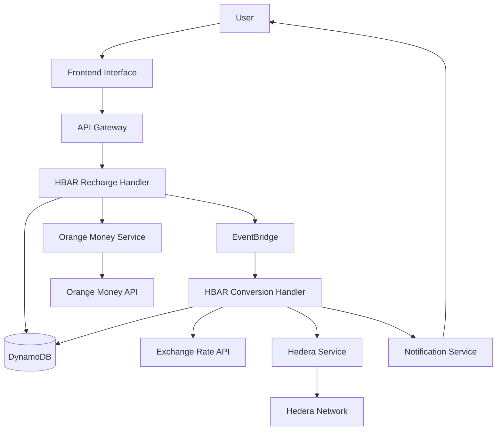
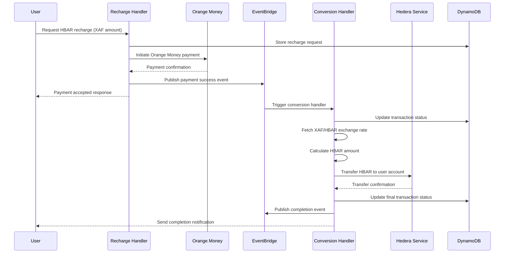

# Design Document

## Overview

The HBAR Recharge System enables users to fund their Hedera accounts using Orange Money mobile payments. The system converts XAF (Central African Franc) to HBAR tokens through a secure, event-driven architecture that integrates Orange Money API with Hedera blockchain operations. The solution extends the existing `om-payments` lambda and leverages the established `HederaService` to provide seamless mobile money to cryptocurrency conversion.

## Architecture

### High-Level Architecture



### Event Flow



## Components and Interfaces

### 1. HBAR Recharge Handler Lambda

**Purpose**: Handles user recharge requests and initiates Orange Money payments

**Key Responsibilities**:

- Validate recharge requests and user authentication
- Calculate fees and display transparent pricing
- Initiate Orange Money payments using existing integration
- Store transaction records in DynamoDB
- Publish events for downstream processing

**API Interface**:

```typescript
interface HBARRechargeRequest {
  userId: string;
  xafAmount: number;
  userHederaAccountId: string;
  pin: string; // Orange Money PIN
}

interface HBARRechargeResponse {
  transactionId: string;
  xafAmount: number;
  estimatedHBARAmount: number;
  conversionRate: number;
  fees: {
    orangeMoneyFee: number;
    platformFee: number;
    totalFees: number;
  };
  status: "payment_initiated" | "payment_confirmed" | "processing";
}
```

### 2. HBAR Conversion Handler Lambda

**Purpose**: Processes successful Orange Money payments and converts to HBAR

**Key Responsibilities**:

- Listen to Orange Money payment success events
- Fetch current XAF/HBAR exchange rates
- Calculate exact HBAR amounts after fees
- Execute HBAR transfers using HederaService
- Handle retry logic for failed transfers
- Update transaction status and notify users

**Event Interface**:

```typescript
interface PaymentSuccessEvent {
  eventId: string;
  eventType: "ORANGE_MONEY_PAYMENT_SUCCESS";
  source: "sachain.payments";
  timestamp: string;
  transactionId: string;
  userId: string;
  xafAmount: number;
  orangeMoneyTransactionId: string;
  userHederaAccountId: string;
}
```

### 3. Enhanced Orange Money Service

**Purpose**: Extend existing Orange Money integration for recharge functionality

**Enhancements**:

- Add recharge-specific payment validation
- Implement webhook handling for payment confirmations
- Add transaction status tracking
- Integrate with EventBridge for event publishing

### 4. Exchange Rate Service

**Purpose**: Provide real-time XAF to HBAR conversion rates

**Key Features**:

- Fetch rates from multiple sources (CoinGecko, CoinMarketCap)
- Implement fallback mechanisms for rate unavailability
- Cache rates with appropriate TTL
- Apply platform fees and conversion margins

**Interface**:

```typescript
interface ExchangeRateService {
  getCurrentRate(): Promise<ExchangeRate>;
  calculateHBARAmount(xafAmount: number): Promise<ConversionResult>;
}

interface ExchangeRate {
  xafToHbar: number;
  lastUpdated: string;
  source: string;
  confidence: "high" | "medium" | "low";
}

interface ConversionResult {
  xafAmount: number;
  hbarAmount: number;
  exchangeRate: number;
  platformFee: number;
  orangeMoneyFee: number;
  netHBARAmount: number;
}
```

### 5. Enhanced Hedera Service Integration

**Purpose**: Extend existing HederaService for HBAR transfers

**New Methods**:

```typescript
interface HBARTransferParams {
  fromAccountId: string;
  toAccountId: string;
  amount: number; // in HBAR
  memo?: string;
}

interface HBARTransferResult {
  transactionId: string;
  transactionHash: string;
  consensusTimestamp: string;
  actualCost: string;
  status: "success" | "failed";
}

class HederaService {
  async transferHBAR(params: HBARTransferParams): Promise<HBARTransferResult>;
  async validateHederaAccount(accountId: string): Promise<boolean>;
  async getAccountBalance(accountId: string): Promise<number>;
}
```

## Data Models

### Recharge Transaction Model

```typescript
interface RechargeTransaction {
  PK: string; // USER#${userId}
  SK: string; // RECHARGE#${transactionId}

  // Core transaction data
  transactionId: string;
  userId: string;
  userHederaAccountId: string;

  // Financial data
  xafAmount: number;
  hbarAmount?: number;
  exchangeRate?: number;

  // Fee breakdown
  orangeMoneyFee: number;
  platformFee: number;
  totalFees: number;

  // Status tracking
  status:
    | "initiated"
    | "payment_confirmed"
    | "converting"
    | "completed"
    | "failed";
  orangeMoneyTransactionId?: string;
  hederaTransactionId?: string;

  // Timestamps
  createdAt: string;
  updatedAt: string;
  completedAt?: string;

  // Error handling
  errorMessage?: string;
  retryCount: number;

  // GSI for status queries
  GSI1PK: string; // RECHARGE_STATUS#${status}
  GSI1SK: string; // ${createdAt}
}
```

### Exchange Rate Cache Model

```typescript
interface ExchangeRateCache {
  PK: string; // EXCHANGE_RATE
  SK: string; // XAF_HBAR

  rate: number;
  source: string;
  lastUpdated: string;
  expiresAt: string;
  confidence: "high" | "medium" | "low";
}
```

## Error Handling

### Error Categories

1. **Validation Errors** (400)

   - Invalid XAF amounts (below minimum or above maximum)
   - Invalid Hedera account IDs
   - Missing required parameters

2. **Authentication Errors** (401/403)

   - Invalid user authentication
   - Insufficient KYC verification for large amounts

3. **Payment Errors** (402)

   - Insufficient Orange Money balance
   - Orange Money service unavailable
   - Invalid PIN or payment rejection

4. **Conversion Errors** (503)

   - Exchange rate service unavailable
   - Hedera network issues
   - Insufficient treasury balance

5. **System Errors** (500)
   - Database connection issues
   - EventBridge publishing failures
   - Unexpected service errors

### Retry Strategy

```typescript
interface RetryConfig {
  maxRetries: number;
  baseDelay: number;
  maxDelay: number;
  backoffMultiplier: number;
  retryableErrors: string[];
}

const RECHARGE_RETRY_CONFIG: RetryConfig = {
  maxRetries: 5,
  baseDelay: 1000,
  maxDelay: 30000,
  backoffMultiplier: 2,
  retryableErrors: [
    "HEDERA_NETWORK_BUSY",
    "EXCHANGE_RATE_UNAVAILABLE",
    "TEMPORARY_SERVICE_ERROR",
  ],
};
```

### Error Recovery

1. **Orange Money Payment Failures**

   - Immediate user notification
   - No HBAR conversion attempted
   - Transaction marked as failed

2. **Exchange Rate Failures**

   - Use cached rates with warnings
   - Implement fallback rate sources
   - Queue for retry with fresh rates

3. **Hedera Transfer Failures**
   - Implement exponential backoff retry
   - Alert administrators for manual intervention
   - Maintain audit trail for refunds

## Testing Strategy

### Unit Tests

1. **Recharge Handler Tests**

   - Request validation logic
   - Fee calculation accuracy
   - Orange Money integration
   - Event publishing

2. **Conversion Handler Tests**

   - Exchange rate calculations
   - HBAR transfer logic
   - Error handling scenarios
   - Retry mechanisms

3. **Service Layer Tests**
   - Exchange rate service reliability
   - Hedera service integration
   - Database operations
   - Event processing

### Integration Tests

1. **End-to-End Recharge Flow**

   - Complete user journey from request to completion
   - Orange Money payment simulation
   - Hedera network interaction
   - Event-driven processing

2. **Error Scenario Testing**

   - Payment failures and recovery
   - Network outages and retries
   - Rate limiting and throttling
   - Data consistency validation

3. **Performance Testing**
   - Concurrent recharge requests
   - High-volume transaction processing
   - Database query optimization
   - API response times

### Security Testing

1. **Authentication and Authorization**

   - User session validation
   - API endpoint security
   - Rate limiting effectiveness

2. **Data Protection**

   - Sensitive data encryption
   - Audit trail integrity
   - PII handling compliance

3. **Financial Security**
   - Transaction integrity
   - Double-spending prevention
   - Fraud detection mechanisms

## Monitoring and Alerting

### Key Metrics

1. **Business Metrics**

   - Recharge success rate
   - Average processing time
   - Total volume processed
   - Fee revenue generated

2. **Technical Metrics**

   - API response times
   - Error rates by category
   - Retry attempt frequency
   - Database performance

3. **Financial Metrics**
   - Exchange rate accuracy
   - Treasury balance levels
   - Transaction cost analysis
   - Revenue vs. costs

### Alerting Thresholds

```typescript
interface AlertThresholds {
  rechargeFailureRate: number; // > 5%
  averageProcessingTime: number; // > 30 seconds
  treasuryBalanceWarning: number; // < 1000 HBAR
  exchangeRateStale: number; // > 5 minutes
  errorRate: number; // > 1%
}
```

### Dashboard Components

1. **Real-time Transaction Status**

   - Active recharge requests
   - Processing queue depth
   - Success/failure rates

2. **Financial Overview**

   - Daily/weekly/monthly volumes
   - Revenue and cost analysis
   - Exchange rate trends

3. **System Health**
   - Service availability
   - Error rate trends
   - Performance metrics

## Security Considerations

### Data Protection

1. **Encryption at Rest**

   - DynamoDB encryption using AWS KMS
   - S3 bucket encryption for logs
   - Secrets Manager for API keys

2. **Encryption in Transit**
   - HTTPS/TLS for all API communications
   - VPC endpoints for AWS service communication
   - Secure Orange Money API integration

### Access Control

1. **IAM Policies**

   - Least privilege principle
   - Service-specific roles
   - Resource-based permissions

2. **API Security**
   - JWT token validation
   - Rate limiting per user
   - Request signing for sensitive operations

### Audit and Compliance

1. **Transaction Logging**

   - Complete audit trail for all operations
   - Immutable log storage
   - Compliance reporting capabilities

2. **KYC Integration**
   - Verification requirements for large amounts
   - AML monitoring and reporting
   - Regulatory compliance tracking

## Deployment Strategy

### Infrastructure as Code

All resources will be defined using AWS CDK with TypeScript:

1. **Lambda Functions**

   - Recharge handler
   - Conversion handler
   - Monitoring functions

2. **Event Infrastructure**

   - EventBridge custom bus
   - Event rules and targets
   - Dead letter queues

3. **Storage Resources**

   - DynamoDB tables with GSIs
   - S3 buckets for logs
   - CloudWatch log groups

4. **Security Resources**
   - IAM roles and policies
   - KMS keys for encryption
   - Secrets Manager entries

### Environment Configuration

```typescript
interface EnvironmentConfig {
  stage: "dev" | "staging" | "prod";
  orangeMoneyConfig: {
    baseUrl: string;
    merchantAccount: string;
    apiTimeout: number;
  };
  hederaConfig: {
    network: "testnet" | "mainnet";
    treasuryAccountId: string;
    maxTransactionFee: number;
  };
  exchangeRateConfig: {
    primarySource: string;
    fallbackSources: string[];
    cacheTimeout: number;
  };
  limits: {
    minRechargeAmount: number;
    maxRechargeAmount: number;
    dailyUserLimit: number;
  };
}
```

This design provides a robust, scalable, and secure foundation for implementing HBAR recharge functionality while leveraging existing platform components and following established architectural patterns.
