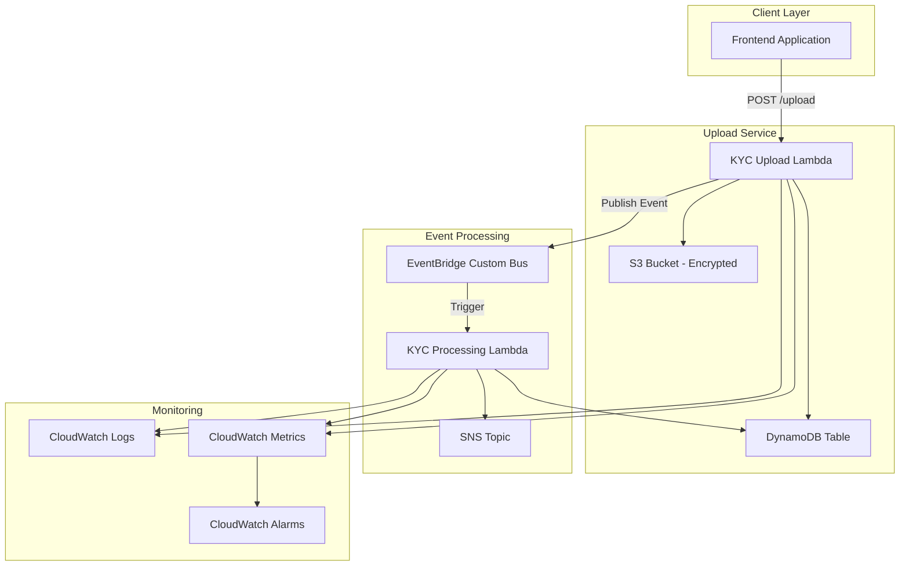
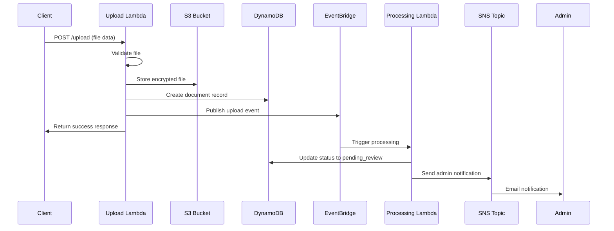

# Design Document

## Overview

The KYC upload refactor transforms the existing monolithic upload Lambda into a focused, event-driven architecture. The new design separates upload operations from processing operations, using EventBridge as the communication mechanism between services. This approach improves maintainability, scalability, and follows microservices best practices.

The refactored system consists of two main components:

1. **KYC Upload Lambda**: Handles file validation, S3 storage, and database record creation
2. **KYC Processing Lambda**: Handles post-upload activities like status updates and admin notifications

## Architecture

### High-Level Architecture



### Event Flow Architecture



### Removed Components

The following components and functionality will be removed from the upload Lambda:

- Presigned URL generation (`handlePresignedUrl` function)
- SNS notification logic in upload handler
- Admin notification sending in upload flow
- Upload processing endpoint (`handleUploadProcessing`)

## Components and Interfaces

### 1. Refactored KYC Upload Lambda

**Purpose**: Handle direct file uploads with validation, S3 storage, and event publishing

**Simplified Interface**:

```typescript
interface DirectUploadRequest {
  documentType: "passport" | "driver_license" | "national_id" | "utility_bill";
  fileName: string;
  contentType: string;
  userId: string;
  fileContent: string; // base64 encoded
}

interface UploadResponse {
  documentId: string;
  message: string;
  status: "uploaded";
}

interface UploadError {
  message: string;
  requestId: string;
  errorCode?: string;
}
```

**Core Functionality**:

```typescript
export const handler: APIGatewayProxyHandler = async (event) => {
  // Only handle POST /upload requests
  if (event.httpMethod !== "POST" || !event.path.includes("/upload")) {
    return {
      statusCode: 404,
      body: JSON.stringify({ message: "Endpoint not found" }),
    };
  }

  try {
    const request = parseUploadRequest(event.body);
    const validationResult = validateUploadRequest(request);

    if (!validationResult.isValid) {
      return createErrorResponse(400, validationResult.error);
    }

    const documentId = generateDocumentId();
    const s3Key = generateS3Key(request.userId, documentId, request.fileName);

    // Upload to S3
    await uploadToS3(s3Key, request.fileContent, request.contentType);

    // Create database record
    await createDocumentRecord(documentId, request, s3Key);

    // Publish event to EventBridge
    await publishUploadEvent({
      documentId,
      userId: request.userId,
      documentType: request.documentType,
      fileName: request.fileName,
      s3Key,
      uploadedAt: new Date().toISOString(),
    });

    return createSuccessResponse(documentId);
  } catch (error) {
    return handleError(error, event.requestContext.requestId);
  }
};
```

### 2. New KYC Processing Lambda

**Purpose**: Handle post-upload processing including status updates and admin notifications

**Event Interface**:

```typescript
interface KYCUploadEvent {
  version: string;
  id: string;
  "detail-type": "KYC Document Uploaded";
  source: "sachain.kyc";
  account: string;
  time: string;
  region: string;
  detail: {
    documentId: string;
    userId: string;
    documentType: string;
    fileName: string;
    s3Key: string;
    uploadedAt: string;
  };
}

interface ProcessingResult {
  documentId: string;
  status: "pending_review" | "processing_failed";
  processedAt: string;
  notificationSent: boolean;
}
```

**Core Functionality**:

```typescript
export const handler: EventBridgeHandler<
  "KYC Document Uploaded",
  KYCUploadDetail,
  void
> = async (event) => {
  const { documentId, userId, documentType, fileName, s3Key } = event.detail;

  try {
    // Update document status to pending_review
    await updateDocumentStatus(userId, documentId, "pending_review");

    // Send admin notification
    await sendAdminNotification({
      documentId,
      userId,
      documentType,
      fileName,
      uploadedAt: event.detail.uploadedAt,
    });

    // Log successful processing
    logger.info("KYC document processing completed", {
      documentId,
      userId,
      status: "pending_review",
    });

    // Emit success metrics
    await putMetric("ProcessingSuccess", 1, { documentType });
  } catch (error) {
    logger.error(
      "KYC document processing failed",
      { documentId, userId },
      error
    );
    await putMetric("ProcessingError", 1, { documentType });
    throw error; // Let EventBridge handle retries
  }
};
```

### 3. EventBridge Integration

**Event Schema**:

```typescript
interface KYCDocumentUploadedEvent {
  version: "0";
  id: string;
  "detail-type": "KYC Document Uploaded";
  source: "sachain.kyc";
  account: string;
  time: string;
  region: string;
  detail: {
    documentId: string;
    userId: string;
    documentType:
      | "passport"
      | "driver_license"
      | "national_id"
      | "utility_bill";
    fileName: string;
    fileSize: number;
    contentType: string;
    s3Key: string;
    s3Bucket: string;
    uploadedAt: string;
    metadata?: Record<string, any>;
  };
}
```

**Event Publishing Utility**:

```typescript
class EventPublisher {
  constructor(
    private eventBridgeClient: EventBridgeClient,
    private eventBusName: string
  ) {}

  async publishKYCUploadEvent(detail: KYCUploadDetail): Promise<void> {
    const event: PutEventsRequestEntry = {
      Source: "sachain.kyc",
      DetailType: "KYC Document Uploaded",
      Detail: JSON.stringify(detail),
      EventBusName: this.eventBusName,
      Time: new Date(),
    };

    await this.eventBridgeClient.send(
      new PutEventsCommand({
        Entries: [event],
      })
    );
  }
}
```

### 4. Simplified File Upload Flow

**Upload Validation**:

```typescript
interface FileValidation {
  validateFileType(contentType: string): boolean;
  validateFileSize(fileContent: string): boolean;
  validateFileName(fileName: string): boolean;
  validateDocumentType(documentType: string): boolean;
}

class FileValidator implements FileValidation {
  private readonly ALLOWED_TYPES = [
    "image/jpeg",
    "image/png",
    "application/pdf",
  ];
  private readonly MAX_SIZE = 10 * 1024 * 1024; // 10MB
  private readonly FILENAME_REGEX = /^[a-zA-Z0-9._-]+\.(jpg|jpeg|png|pdf)$/i;

  validateFileType(contentType: string): boolean {
    return this.ALLOWED_TYPES.includes(contentType);
  }

  validateFileSize(fileContent: string): boolean {
    const buffer = Buffer.from(fileContent, "base64");
    return buffer.length <= this.MAX_SIZE;
  }

  validateFileName(fileName: string): boolean {
    return this.FILENAME_REGEX.test(fileName);
  }

  validateDocumentType(documentType: string): boolean {
    return [
      "passport",
      "driver_license",
      "national_id",
      "utility_bill",
    ].includes(documentType);
  }
}
```

**S3 Upload Utility**:

```typescript
class S3UploadService {
  constructor(
    private s3Client: S3Client,
    private bucketName: string,
    private kmsKeyId?: string
  ) {}

  async uploadDocument(
    s3Key: string,
    fileContent: string,
    contentType: string,
    metadata: Record<string, string>
  ): Promise<void> {
    const buffer = Buffer.from(fileContent, "base64");

    const command = new PutObjectCommand({
      Bucket: this.bucketName,
      Key: s3Key,
      Body: buffer,
      ContentType: contentType,
      ServerSideEncryption: "aws:kms",
      SSEKMSKeyId: this.kmsKeyId,
      Metadata: metadata,
    });

    await this.s3Client.send(command);
  }
}
```

## Data Models

### Updated KYC Document Model

```typescript
interface KYCDocument {
  PK: string; // USER#${userId}
  SK: string; // DOCUMENT#${documentId}
  GSI1PK: string; // KYC#${status}
  GSI1SK: string; // ${uploadedAt}
  GSI2PK: string; // DOCUMENT#${documentType}
  GSI2SK: string; // ${uploadedAt}

  // Core fields
  documentId: string;
  userId: string;
  documentType: "passport" | "driver_license" | "national_id" | "utility_bill";
  fileName: string;
  fileSize: number;
  contentType: string;
  s3Key: string;
  s3Bucket: string;

  // Status tracking
  status: "uploaded" | "pending_review" | "approved" | "rejected";
  uploadedAt: string;
  processedAt?: string; // When processing Lambda completed
  reviewedAt?: string;
  reviewedBy?: string;

  // Additional metadata
  rejectionReason?: string;
  metadata?: Record<string, any>;
}
```

### Event Audit Model

```typescript
interface EventAuditLog {
  PK: string; // EVENT#${date}
  SK: string; // ${timestamp}#${eventId}

  eventId: string;
  eventType: "kyc_document_uploaded" | "kyc_document_processed";
  source: string;
  timestamp: string;

  // Event details
  documentId: string;
  userId: string;
  status: "success" | "failed";
  processingDuration?: number;
  errorMessage?: string;

  // Metadata
  requestId?: string;
  correlationId?: string;
}
```

## Error Handling

### Upload Lambda Error Handling

```typescript
class UploadErrorHandler {
  static handleError(error: Error, requestId: string): APIGatewayProxyResult {
    const errorDetails = ErrorClassifier.classify(error);

    logger.error(
      "Upload failed",
      {
        requestId,
        errorCategory: errorDetails.category,
        errorCode: errorDetails.errorCode,
      },
      error
    );

    return {
      statusCode: errorDetails.httpStatusCode || 500,
      headers: {
        "Content-Type": "application/json",
        "Access-Control-Allow-Origin": "*",
      },
      body: JSON.stringify({
        message: errorDetails.userMessage,
        requestId,
        errorCode: errorDetails.errorCode,
      }),
    };
  }
}
```

### Processing Lambda Error Handling

```typescript
class ProcessingErrorHandler {
  static async handleProcessingError(
    error: Error,
    documentId: string,
    userId: string
  ): Promise<void> {
    const errorDetails = ErrorClassifier.classify(error);

    // Log the error
    logger.error(
      "Processing failed",
      {
        documentId,
        userId,
        errorCategory: errorDetails.category,
      },
      error
    );

    // Update document status to indicate processing failure
    if (errorDetails.category === "PERMANENT") {
      await updateDocumentStatus(userId, documentId, "processing_failed");
    }

    // Emit error metrics
    await putMetric("ProcessingError", 1, {
      errorCategory: errorDetails.category,
      documentId,
    });

    // For transient errors, let EventBridge retry
    if (errorDetails.category === "TRANSIENT") {
      throw error;
    }
  }
}
```

### EventBridge Retry Configuration

```typescript
interface EventBridgeRetryConfig {
  maximumRetryAttempts: 3;
  maximumEventAge: 3600; // 1 hour
  deadLetterQueue?: {
    arn: string;
  };
}

// CDK Configuration
const rule = new Rule(this, "KYCProcessingRule", {
  eventBus: customEventBus,
  eventPattern: {
    source: ["sachain.kyc"],
    detailType: ["KYC Document Uploaded"],
  },
  targets: [
    new LambdaFunction(processingLambda, {
      retryAttempts: 3,
      maxEventAge: Duration.hours(1),
      deadLetterQueue: dlq,
    }),
  ],
});
```

## Testing Strategy

### Unit Testing for Upload Lambda

```typescript
describe("KYC Upload Lambda", () => {
  let mockS3Client: jest.Mocked<S3Client>;
  let mockDynamoClient: jest.Mocked<DynamoDBDocumentClient>;
  let mockEventBridge: jest.Mocked<EventBridgeClient>;

  beforeEach(() => {
    mockS3Client = createMockS3Client();
    mockDynamoClient = createMockDynamoClient();
    mockEventBridge = createMockEventBridgeClient();
  });

  it("should upload file and publish event successfully", async () => {
    const event = createMockAPIGatewayEvent({
      body: JSON.stringify({
        userId: "user123",
        documentType: "national_id",
        fileName: "id.jpg",
        contentType: "image/jpeg",
        fileContent: "base64content",
      }),
    });

    const result = await handler(event);

    expect(result.statusCode).toBe(200);
    expect(mockS3Client.send).toHaveBeenCalledWith(
      expect.any(PutObjectCommand)
    );
    expect(mockDynamoClient.send).toHaveBeenCalledWith(expect.any(PutCommand));
    expect(mockEventBridge.send).toHaveBeenCalledWith(
      expect.any(PutEventsCommand)
    );
  });

  it("should return 400 for invalid file type", async () => {
    const event = createMockAPIGatewayEvent({
      body: JSON.stringify({
        userId: "user123",
        documentType: "national_id",
        fileName: "document.txt",
        contentType: "text/plain",
        fileContent: "base64content",
      }),
    });

    const result = await handler(event);

    expect(result.statusCode).toBe(400);
    expect(JSON.parse(result.body).message).toContain("Invalid file type");
  });
});
```

### Integration Testing

```typescript
describe("KYC Upload Integration", () => {
  it("should complete end-to-end upload and processing flow", async () => {
    // Upload document
    const uploadResponse = await uploadDocument({
      userId: "test-user",
      documentType: "national_id",
      fileName: "test-id.jpg",
      fileContent: validBase64Image,
    });

    expect(uploadResponse.statusCode).toBe(200);
    const { documentId } = JSON.parse(uploadResponse.body);

    // Wait for EventBridge processing
    await waitForProcessing(documentId, 5000);

    // Verify document status updated
    const document = await getDocument("test-user", documentId);
    expect(document.status).toBe("pending_review");

    // Verify admin notification sent
    const notifications = await getSNSMessages();
    expect(notifications).toContainEqual(
      expect.objectContaining({
        documentId,
        userId: "test-user",
      })
    );
  });
});
```

## Security Considerations

### Upload Lambda Security

- **Input Validation**: Strict validation of all input parameters
- **File Content Validation**: Verify file headers match declared content types
- **Size Limits**: Enforce maximum file size limits
- **Rate Limiting**: Implement per-user upload rate limits
- **IAM Permissions**: Minimal permissions for S3 and DynamoDB access

### Processing Lambda Security

- **Event Validation**: Validate EventBridge event structure and source
- **Secure Document Access**: Use pre-signed URLs for admin document access
- **Audit Logging**: Log all processing activities for compliance
- **Error Information**: Avoid exposing sensitive information in error messages

### EventBridge Security

- **Event Encryption**: Encrypt events in transit and at rest
- **Access Control**: Restrict event publishing to authorized services
- **Event Validation**: Validate event schemas and sources
- **Dead Letter Queues**: Secure handling of failed events

## Monitoring and Observability

### CloudWatch Metrics

**Upload Lambda Metrics**:

- `UploadSuccess` - Successful uploads by document type
- `UploadError` - Failed uploads by error category
- `UploadDuration` - Time taken for upload operations
- `FileSize` - Distribution of uploaded file sizes

**Processing Lambda Metrics**:

- `ProcessingSuccess` - Successful processing operations
- `ProcessingError` - Failed processing operations
- `ProcessingDuration` - Time taken for processing
- `NotificationSuccess` - Successful admin notifications

**EventBridge Metrics**:

- `EventsPublished` - Number of events published
- `EventsProcessed` - Number of events processed
- `EventProcessingLatency` - Time from publish to processing

### Structured Logging

```typescript
interface LogContext {
  requestId: string;
  userId?: string;
  documentId?: string;
  operation: string;
  duration?: number;
  errorCategory?: string;
}

class StructuredLogger {
  info(message: string, context: LogContext): void {
    console.log(
      JSON.stringify({
        level: "INFO",
        message,
        timestamp: new Date().toISOString(),
        ...context,
      })
    );
  }

  error(message: string, context: LogContext, error?: Error): void {
    console.log(
      JSON.stringify({
        level: "ERROR",
        message,
        timestamp: new Date().toISOString(),
        error: error?.message,
        stack: error?.stack,
        ...context,
      })
    );
  }
}
```

### Alerting Strategy

**Critical Alerts**:

- Upload error rate > 5% in 5 minutes
- Processing error rate > 10% in 5 minutes
- EventBridge event processing delays > 5 minutes
- S3 upload failures
- DynamoDB throttling events

**Warning Alerts**:

- Upload latency > 2 seconds (95th percentile)
- Processing latency > 30 seconds (95th percentile)
- High file upload volume (> 1000 uploads/hour)

## Migration Strategy

### Phase 1: Deploy New Processing Lambda

1. Deploy the new KYC Processing Lambda
2. Configure EventBridge rules and targets
3. Test processing Lambda with synthetic events
4. Monitor processing Lambda performance

### Phase 2: Update Upload Lambda

1. Deploy refactored Upload Lambda alongside existing version
2. Route small percentage of traffic to new version
3. Monitor upload success rates and error rates
4. Gradually increase traffic to new version

### Phase 3: Remove Legacy Code

1. Remove presigned URL endpoints from old Lambda
2. Remove SNS notification code from upload flow
3. Clean up unused dependencies and utilities
4. Update API documentation and client SDKs

### Rollback Plan

- Keep old Lambda version available for immediate rollback
- Maintain EventBridge rule to route to old processing logic if needed
- Monitor key metrics during migration for early issue detection
- Automated rollback triggers based on error rate thresholds
